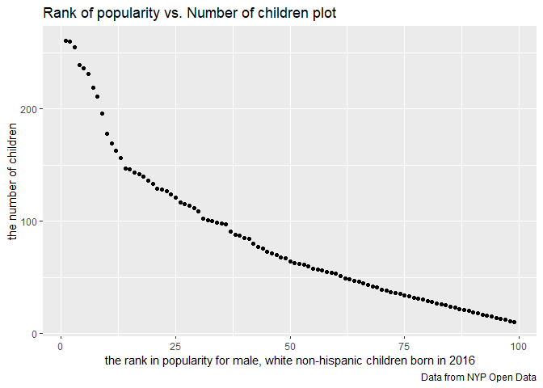

P8104\_HW2\_zz2603
================
Ziyi Zhao
9/27/2019

# Problem 1

## Mr. Trash Wheel

``` r
MRtrashW <- read_excel(
  "./data/Trash-Wheel-Collection-Totals-8-6-19.xlsx",
  sheet = "Mr. Trash Wheel") %>% 
  janitor::clean_names() %>% select(-c(x15:x17)) %>% drop_na(dumpster)
```

    ## New names:
    ## * `` -> ...15
    ## * `` -> ...16
    ## * `` -> ...17

``` r
MRtrashW[,13] <- round(MRtrashW[,13],digits = 0)

sball_int <- as.integer(pull(MRtrashW,sports_balls))
```

## Total precipitation in 2017 and 2018

``` r
## 2017
precip17 <- read_excel(
  "./data/Trash-Wheel-Collection-Totals-8-6-19.xlsx",
  sheet="2017 Precipitation"
)
```

    ## New names:
    ## * `` -> ...2

``` r
colnames(precip17) <- c("month", "total")
precip17 <- precip17[-1,] %>% drop_na(total)
precip17 <- mutate(precip17, year = c(rep(2017,dim(precip17)[1]-1),NA))

precip17 <- precip17[,c(3,1,2)]

## 2018
precip18 <- read_excel(
  "./data/Trash-Wheel-Collection-Totals-8-6-19.xlsx",
  sheet="2018 Precipitation"
)
```

    ## New names:
    ## * `` -> ...2

``` r
colnames(precip18) <- c("month", "total")
precip18 <- precip18[-1,] %>% drop_na(total)
precip18 <- mutate(precip18, year = c(rep(2018,dim(precip18)[1]-1),NA))
precip18 <- precip18[,c(3,1,2)]

## set a character vector of month name from Jan to Dec
## in fact, it's unnecessary.
monthname<- month.name

## bind two datasets together
precip1718 <- bind_rows(precip17,precip18)
precip1718[,2] <- monthname[as.numeric(pull(precip1718,month))]
```

## paragraph

We imported the Mr. Trash Wheel and precipitation in 2017 and 2018 from
the excel file *Trash-Wheel-Collection-Totals-8-6-19.xlsx*. In the
dataset of Mr. Trash Wheel, there are 344 observations left after we
removed observations without specific dumpster number. We also rounds
the number of sport balls in each dumpster into integer. The median of
sport balls is 8. In the dataset of precipitation in 2017, there are 13
observations left after we omitted observations without any data of
precipitation. In the dataset of precipitation in 2018, there are 13
observations left after we omitted observations without any
precipitation data. (We also count the value of total precipitation at
the last row in each dataset.) After we combine them together, there are
26 observations in total. The total precipitation in 2018 is 70.33. In
these two resulting datasets, I think key variables includes month,
year, total precipitation, variables of trash (i.e. sports balls),
because the amount of precipitation can help us determine the strength
and number of storms each month and year. Then, we can use precipitation
to see how storm affect the amount of trash each month and year.

# Problem 2

## pol-month.csv

``` r
polmonth <- read_csv("./data/pols-month.csv") %>% 
  janitor::clean_names() %>%
  separate(col=mon,into = c("year","month","day"),sep = "-")
```

    ## Parsed with column specification:
    ## cols(
    ##   mon = col_date(format = ""),
    ##   prez_gop = col_double(),
    ##   gov_gop = col_double(),
    ##   sen_gop = col_double(),
    ##   rep_gop = col_double(),
    ##   prez_dem = col_double(),
    ##   gov_dem = col_double(),
    ##   sen_dem = col_double(),
    ##   rep_dem = col_double()
    ## )

``` r
polmonth[,1] <- as.integer(pull(polmonth,year))
polmonth[,2] <- as.integer(pull(polmonth,month))
polmonth[,3] <- as.integer(pull(polmonth,day))

polmonth[,2] <- monthname[pull(polmonth,month)]

polmonth <- pivot_longer(polmonth,
                    c(prez_gop,prez_dem),
                    names_to = "president",
                    names_prefix = "prez_") %>% 
  select(-day) %>%
  filter(value!=0) %>% 
  select(-value)
```

## snp.csv

``` r
snp <- read_csv("./data/snp.csv") %>% janitor::clean_names() %>% 
  separate(col=date,into = c("month","day","year"),sep = "/")
```

    ## Parsed with column specification:
    ## cols(
    ##   date = col_character(),
    ##   close = col_double()
    ## )

``` r
snp[,1] <- as.integer(pull(snp,month))
snp[,2] <- as.integer((pull(snp,day)))
snp[,3] <- as.integer((pull(snp,year)))

snp <- snp[,c(3,1,2,4)]

snp[,2] <- monthname[pull(snp,month)]

snp <- select(snp,-day)
```

## unemployment.csv

``` r
unemploy <- read_csv("./data/unemployment.csv") %>% 
  pivot_longer(
    Jan:Dec,
    names_to = "month",
    values_to = "unemployment_rate"
  ) %>% janitor::clean_names()
```

    ## Parsed with column specification:
    ## cols(
    ##   Year = col_double(),
    ##   Jan = col_double(),
    ##   Feb = col_double(),
    ##   Mar = col_double(),
    ##   Apr = col_double(),
    ##   May = col_double(),
    ##   Jun = col_double(),
    ##   Jul = col_double(),
    ##   Aug = col_double(),
    ##   Sep = col_double(),
    ##   Oct = col_double(),
    ##   Nov = col_double(),
    ##   Dec = col_double()
    ## )

``` r
monthabb <- month.abb
## convert abbreviation into number
unemploy[,2] <- match(pull(unemploy,month),monthabb)
## convert number into full names of months
unemploy[,2] <- monthname[pull(unemploy,month)]
```

## merge pols, snp and unemployment togather

``` r
pol_merg_snp <- left_join(x=polmonth,y=snp,by=c("year","month")) 

pol_merg_snp_merg_unemploy <- left_join(
  x=pol_merg_snp,
  y=unemploy,
  by=c("year","month")
)
```

### paragraph

The dataset of pols-month contains 822 rows and 9 columns in total. The
year ranged from 1947 to 2015. The key variables that we used to merge
(left join) is *year* and *month* (first by year, then by month). The
variables *president* indicate if he/she is belong to republican and
democratic. The dataset of snp contains 787 rows and 3 columns in total.
The year ranged from 1950 to 2015. Besides *year* and *month*, the
variable *close* are also important because it indicates the closing
values of the S\&P stock index on the associated date. The dataset of
unemployment contains 816 rows and 3 columns in total. The year ranged
from 1948 to 2015. the new variable *unemployment rate* is created to
represent the values of percentage of unemployment. The final merged
dataset contains 822 rows and 11 columns. The year ranged from 1947 to
2015. There are some NA created under variables *close* and
*unemployment rate* during merging datasets.The important variables
includes presidents’ party affiliation, number of governors and senators
across different time period.

# Problem 3

``` r
pop_baby_name <- read_csv("./data/Popular_Baby_Names.csv")%>%
  janitor::clean_names()
```

    ## Parsed with column specification:
    ## cols(
    ##   `Year of Birth` = col_double(),
    ##   Gender = col_character(),
    ##   Ethnicity = col_character(),
    ##   `Child's First Name` = col_character(),
    ##   Count = col_double(),
    ##   Rank = col_double()
    ## )

``` r
## check how many differnt ethnicities it have
pop_baby_name %>% 
  group_by(ethnicity) %>% 
  summarize(n=n())
```

    ## # A tibble: 7 x 2
    ##   ethnicity                      n
    ##   <chr>                      <int>
    ## 1 ASIAN AND PACI               693
    ## 2 ASIAN AND PACIFIC ISLANDER  2693
    ## 3 BLACK NON HISP               681
    ## 4 BLACK NON HISPANIC          2826
    ## 5 HISPANIC                    5714
    ## 6 WHITE NON HISP              1338
    ## 7 WHITE NON HISPANIC          5473

``` r
## there are lots of ethnicity names stands for same meaning but seems 
## differnt.
ethn <- pull(pop_baby_name,ethnicity)

for (i in 1:length(ethn)) {
  if (ethn[i]=="ASIAN AND PACI") {
    ethn[i] <- paste0(ethn[i], "FIC ISLANDER")
  } else if (ethn[i]=="BLACK NON HISP") {
    ethn[i] <- paste0(ethn[i],"ANIC")
  } else if (ethn[i]=="WHITE NON HISP") {
    ethn[i] <- paste0(ethn[i],"ANIC")
  }
}

pop_baby_name[,3] <- ethn

## check the gender
pop_baby_name %>% 
  group_by(gender) %>% 
  summarize(n=n())
```

    ## # A tibble: 2 x 2
    ##   gender     n
    ##   <chr>  <int>
    ## 1 FEMALE  9933
    ## 2 MALE    9485

``` r
## standarized name of children to ALL CAPITAL letter
childname <- pull(pop_baby_name,childs_first_name) %>% str_to_upper()
pop_baby_name[,4] <- childname

## remove all duplicated rows
pop_baby_name <- distinct(pop_baby_name)

## create "reader-friendly" table to show the rank in popularity of the name
## “Olivia” as a female baby name over time. 
pop_baby_name %>% 
  filter(gender=="FEMALE"&childs_first_name=="OLIVIA") %>%
  select(-count) %>% 
  pivot_wider(
    names_from = year_of_birth,
    values_from = rank) %>% 
  select(-c(gender,childs_first_name)) %>% 
  knitr::kable()
```

| ethnicity                  | 2016 | 2015 | 2014 | 2013 | 2012 | 2011 |
| :------------------------- | ---: | ---: | ---: | ---: | ---: | ---: |
| ASIAN AND PACIFIC ISLANDER |    1 |    1 |    1 |    3 |    3 |    4 |
| BLACK NON HISPANIC         |    8 |    4 |    8 |    6 |    8 |   10 |
| HISPANIC                   |   13 |   16 |   16 |   22 |   22 |   18 |
| WHITE NON HISPANIC         |    1 |    1 |    1 |    1 |    4 |    2 |

``` r
## create a similar table showing the most popular name among male children 
## over time
pop_baby_name %>% 
  filter(gender=="MALE"&rank==1) %>%
  select(-c(gender,count)) %>% 
  pivot_wider(
    names_from = year_of_birth,
    values_from = childs_first_name) %>% 
  select(-rank) %>% 
  knitr::kable()
```

| ethnicity                  | 2016   | 2015   | 2014   | 2013   | 2012   | 2011    |
| :------------------------- | :----- | :----- | :----- | :----- | :----- | :------ |
| ASIAN AND PACIFIC ISLANDER | ETHAN  | JAYDEN | JAYDEN | JAYDEN | RYAN   | ETHAN   |
| BLACK NON HISPANIC         | NOAH   | NOAH   | ETHAN  | ETHAN  | JAYDEN | JAYDEN  |
| HISPANIC                   | LIAM   | LIAM   | LIAM   | JAYDEN | JAYDEN | JAYDEN  |
| WHITE NON HISPANIC         | JOSEPH | DAVID  | JOSEPH | DAVID  | JOSEPH | MICHAEL |

``` r
## create a scatterplot showing the number of children with a name (y axis)
## against the rank in popularity of that name (x axis) for male, white 
## non-hispanic children born in 2016
pop_baby_name %>% 
  filter(gender=="MALE"&
           ethnicity=="WHITE NON HISPANIC"&
           year_of_birth==2016) %>% 
  ggplot(aes(x=rank,y=count))+geom_point()+
  labs(
    title = "Rank of popularity vs. Number of children plot",
    x = "the rank in popularity for male, white non-hispanic children born in 2016",
    y = "the number of children",
    caption = "Data from NYP Open Data"
  )
```

<!-- -->
